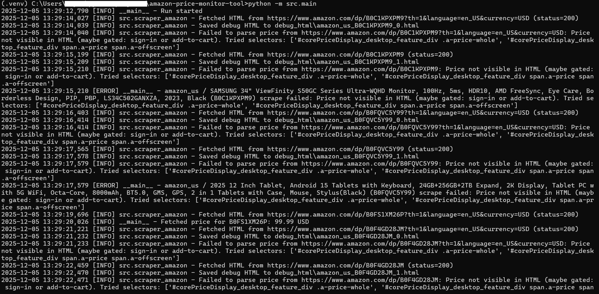
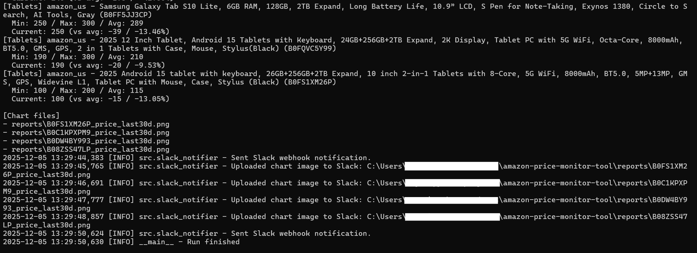
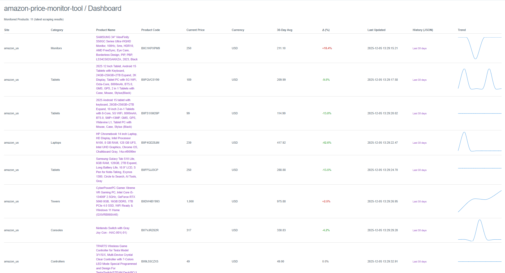
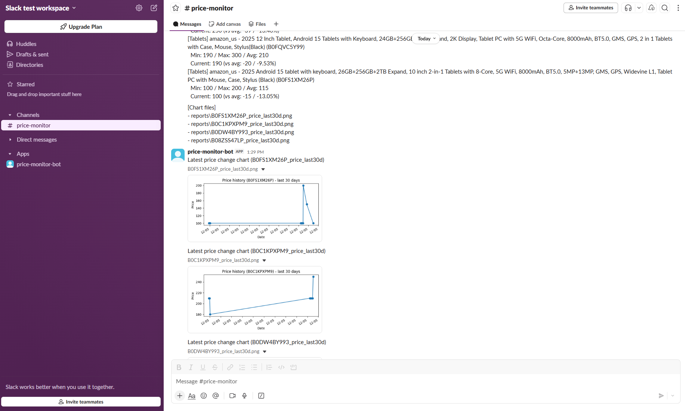

# Amazon Price Monitor Tool

[](https://www.python.org/)
[](https://fastapi.tiangolo.com/)


[](LICENSE)

A production-grade **Amazon price monitoring** system built with **Python**, **FastAPI**, and **SQLite**.

- Tracks **historical prices** for Amazon products (USD).
- Detects meaningful **price drops / increases**.
- Sends **real-time Slack alerts** with text + charts (optional).
- Exposes a **web dashboard + JSON API** for analysis and automation.

Designed to be realistic as a **portfolio-quality** automation tool, and practical enough to use on real-world monitoring tasks.

---

## Portfolio Highlights (Skills Demonstrated)

 - Web scraping of real-world e-commerce sites (Amazon)
 - Robust parsing with selector fallbacks and debug HTML dumps
 - Historical price tracking and diff/statistics computation
 - FastAPI-based JSON API and dashboard (Jinja2 + Chart.js)
 - Slack integration (webhook and bot file upload)
 - Automated tests (pytest) and linting (ruff) enforced via GitHub Actions CI
 - Config-driven design (YAML targets/settings, .env for secrets)

---

## Screenshots

<p align="center">
  
</p>

<p align="center">
  
</p>

<p align="center">
  
</p>

<p align="center">
  
</p>

---

## table of contents

 - [Overview](#overview)
 - [Why This Tool Matters](#why-this-tool-matters)
  - [How This Saves Time & Money](#how-this-saves-time--money)
  - [Who This Helps](#who-this-helps)
  - [Legal & Ethical Note](#legal--ethical-note)
  - [Production Use Note](#production-use-note)
 - [Key Features](#key-features)
 - [Architecture & Data Flow](#architecture--data-flow)
 - [Requirements](#requirements)
 - [Installation](#installation)
 - [Configuration](#configuration)
  - [1. Environment (.env)](#1-environment-env)
  - [2. Products (config/targets.yml)](#2-products-configtargetsyml)
  - [3. Scraper Settings (config/settings.yml)](#3-scraper-settings-configsettingsyml)
 - [Running the Tool](#running-the-tool)
  - [CLI Job](#cli-job)
  - [Scheduling](#scheduling)
  - [Files & Artifacts](#files--artifacts)
 - [Dashboard & API](#dashboard--api)
  - [Starting the API Server](#starting-the-api-server)
  - [Endpoints](#endpoints)
  - [cURL Examples](#curl-examples)
  - [Python Client Example](#python-client-example)
 - [How to Adapt for Your Business](#how-to-adapt-for-your-business)
 - [For Developers](#for-developers)
 - [Project Structure](#project-structure)
 - [License](#license)
 - [Contributing](#contributing)
 - [Author](#author)

---

## Overview

This project is a **single-purpose Amazon price monitor**:

1. **Scrape** product prices in USD from Amazon.
2. **Store** every observation in a **SQLite** database.
3. **Derive** diffs and statistics (min/max/avg, latest change).
4. **Render** charts and summary reports.
5. **Notify** via Slack (optional).
6. **Serve** data via a **FastAPI** dashboard and JSON API.

Out of the box, it supports **amazon.com (USD)** with configurable products and selectors via YAML.

---

## why this tool matters

### How this saves time & money

Typical “manual monitoring” pattern:

- 20 products
- 5 minutes per product
- Checked once per working day

That’s ~**100 minutes/day** → **~35 hours/month** spent on:

- Opening product pages
- Checking if prices changed
- Copying values into spreadsheets
- Notifying teammates in chat

With this tool:

- A scheduled job runs in the background (Task Scheduler / cron).
- Only **meaningful changes** trigger alerts.
- Slack notifications include **old vs new price** and **trend charts**.
- The dashboard and API offer always-up-to-date history for analysis.

Result: The responsible person focuses on **decisions**, not repetitive checking.

### Who this helps

- **E-commerce sellers** tracking their own listings or selected competitors.
- **Small businesses** managing Amazon-based pricing strategies.
- **Analysts** needing reliable price history for models and reports.
- **Freelance Python/automation engineers** demonstrating real-world skills.

### Legal & ethical note

This project is intended for **responsible, low-frequency monitoring** of products you are allowed to track.

> **Always** respect:
> - Each website’s **Terms of Service**
> - **robots.txt**
> - Local laws and regulations about scraping and data usage

You are fully responsible for how you run and deploy this code.

### Production Use Note

This project uses HTML scraping to demonstrate real-world engineering skills,
including HTTP fetching, parsing, failure handling, persistence, diff logic,
alerting, dashboards, and automated testing.

For any *serious production workload*, high-frequency monitoring, or
commercial deployment, **Amazon’s official Product Advertising API (PA-API)**  
or other authorized data feeds should be preferred.

HTML scraping is used here **strictly for educational and portfolio purposes**
to showcase the underlying engineering, not as a replacement for the official API.

---

## key features

 - **USD-only price monitoring**
  - Stores currency for each observation
  - Stats and diffs are based on **USD rows only**
 - **Amazon-only scraper** with configurable **CSS selectors**
 - **Multiple URL strategies** (USD-focused URL building with fallback HTML)
 - **Robust storage** in **SQLite** (`data/database.sqlite`)
 - **Price diff detection**
  - Up/down/no-change
  - Thresholds via YAML config
 - **Optional Slack alerts**
  - Webhook-based text messages
  - Bot API chart file uploads
 - **FastAPI dashboard**
  - Product table with status and metadata
  - Inline **sparkline charts** (Chart.js)
 - **JSON API**
  - Latest prices
  - Historical series per product (JSON + CSV)
  - Product list for integrations
 - **Historical reporting**
  - Text reports and static charts under `reports/`
 - **Debug HTML dumps**
  - Failed scrapes persisted under `debug_html/` for analysis
 - **Automated quality guardrails**
  - Pytest-based tests (unit + integration + API)
  - `ruff` linting
  - **GitHub Actions CI** (`.github/workflows/ci.yml`)

---

## architecture & data flow

At a high level:

1. **Trigger**: CLI (`python -m src.main`) or API (`POST /run`) starts a monitoring job.
2. **Config load**: Reads `config/targets.yml` (products) and `config/settings.yml` (scraper tuning).
3. **Scraping**: `src/scraper_amazon.py` fetches HTML and parses prices via CSS selectors.
4. **Persistence**: `src/db.py` writes each observation into the `prices` table (with currency).
5. **Computation**: `src/price_logic.py` computes diffs and stats, and renders charts via matplotlib.
6. **Notification**: `src/slack_notifier.py` optionally sends messages and charts to Slack.
7. **Serving**: `src/api_app.py` exposes JSON endpoints and the HTML dashboard (Chart.js-based).

### Architecture diagram (text / Mermaid)

```mermaid
flowchart LR
    Scheduler[Task Scheduler / cron] --> MainJob[python -m src.main]
    MainJob --> Scraper[scraper_amazon.fetch_price]
    Scraper --> DB[(SQLite: prices table)]
    MainJob --> Logic[price_logic: diffs & stats]
    DB --> Logic
    Logic --> Reports[Charts + text reports in reports/]
    Logic --> Slack[Slack notifier (optional)]
    DB --> API[FastAPI app]
    API --> Dashboard[HTML dashboard + Chart.js]
    API --> Clients[Scripts / integrations]
```

For more detail, see:

- `docs/architecture.md`
- `docs/data_flow.md`
- `docs/operations.md`
- `docs/testing.md`

---

## Requirements

- Python: 3.10+ (tested with 3.11)
- SQLite: bundled with Python
- pip + virtualenv recommended
- For Slack integration:
 - SLACK_WEBHOOK_URL
 - SLACK_BOT_TOKEN
 - SLACK_CHANNEL_ID

 ---

## installation

```bash
# 1) Clone the repo
git clone https://github.com/ryuhei-py/amazon-price-monitor-tool.git
cd amazon-price-monitor-tool

# 2) Create and activate a virtualenv (Windows example)
python -m venv .venv
.venv\Scripts\activate

# 3) Install dependencies
pip install --upgrade pip
pip install -r requirements.txt
pip install -r requirements-dev.txt  # for tests, lint, dev tools
```

---

## configuration

### 1. Environment (.env)

Copy the example file and fill in secrets:

```bash
cp .env.example .env
```

`.env` fields (optional but recommended for Slack):

```ini
SLACK_WEBHOOK_URL=...
SLACK_BOT_TOKEN=...
SLACK_CHANNEL_ID=...
```

If these are empty or slack_sdk is not installed, Slack notifications are safely skipped.

### 2. Products (config/targets.yml)

This file defines what you monitor.

**Example:**

```yaml
settings:
  notify:
    min_abs_diff: 0          # minimum absolute difference in USD to report
    min_rate_percent: 0      # minimum percentage change to report

targets:
  - code: GAMING-PC-01
    asin: B0DW4BY993
    market: amazon_us
    enabled: true
    name: CyberPowerPC Gamer Xtreme VR Gaming PC
    category: Desktops
    selector: '#corePriceDisplay_desktop_feature_div .a-price-whole'

  - code: PS5-SLIM
    asin: B0CL5H3WGM
    market: amazon_us
    enabled: true
    name: PlayStation 5 Slim Console
    category: Consoles
    selector: '#corePriceDisplay_desktop_feature_div .a-price-whole'
```

Fields:

- `settings.notify.min_abs_diff` — Minimum absolute USD change to trigger reporting.
- `settings.notify.min_rate_percent` — Minimum percentage change to trigger reporting.
- `targets[*].code` — Your internal product code (used in logs and API).
- `targets[*].asin` — Amazon ASIN.
- `targets[*].market` — Currently: amazon_us.
- `targets[*].enabled` — Toggle monitoring of this target.
- `targets[*].name` / category — Free text metadata for dashboard and reports.
- `targets[*].selector` — CSS selector used to locate the price element.

You can manage this file via the helper CLI:

```bash
# Add a new product interactively
python -m src.manage_targets add

# Try to auto-populate from a URL
python -m src.manage_targets auto

# List configured targets
python -m src.manage_targets list
```

### 3. Scraper settings (config/settings.yml)

Fine-tune scraper behavior and USD enforcement:

```yaml
scraper:
  force_usd: true         # if true, non-USD prices are rejected
  user_agent: "Mozilla/5.0 (Windows NT 10.0; Win64; x64) AppleWebKit/537.36 (KHTML, like Gecko) Chrome/120.0 Safari/537.36"
  timeout: 10             # HTTP timeout (seconds)
  max_retries: 3          # retry count per request
  sleep_sec: 2.0          # delay between requests
  debug_html_dir: "debug_html"  # folder for failed HTML dumps
```

Notes:
- `force_usd: true` ensures statistics and monitoring remain in USD only.
- When parsing fails or non-USD data is encountered, the raw HTML is dumped into the configured `debug_html_dir` for later inspection.

---

## running the tool

### CLI job

Typical single run:

```bash
# With Slack notifications (if configured)
python -m src.main
```

Useful options:

```bash
# Disable Slack (no notifications, no image uploads)
python -m src.main --no-slack

# Process only specific products (by code)
python -m src.main --products GAMING-PC-01 PS5-SLIM

# Regenerate reports and charts from existing DB only (no scraping)
python -m src.main --print-report-only

# Dry run (scrape + in-memory reports, but do not write to DB)
python -m src.main --dry-run
```

Logs will describe:

- Which targets were scraped
- Success/failure details
- Price changes and resulting diffs
- Generated reports and chart locations

### Scheduling

See `docs/operations.md` for more detailed guidance.

**Windows Task Scheduler**

- Point a scheduled task to `run_scraper.bat` which:
 - Activates `.venv`
 - Runs `python -m src.main`

**Linux / macOS (cron)**

Example daily at 08:00:

```cron
0 8 * * * /path/to/.venv/bin/python -m src.main --no-slack
```

### Files & artifacts

- `data/database.sqlite` — Main SQLite database; safe to back up and inspect.
- `logs/` — Run logs; useful for troubleshooting. Git-ignored.
- `reports/` — Text reports and charts (matplotlib output). Git-ignored.
- `debug_html/` — HTML snapshots for failed or suspicious scrapes. Git-ignored.

All of these are regenerable and are safe to delete in a local dev environment (the database if you are okay with losing history).

A helper exists for cleaning dev artifacts (without dropping the database by default):

```bash
python -m tools.cleanup_dev_artifacts
```

---

## dashboard & API

### Starting the API server

Run the FastAPI app (with Uvicorn):

```bash
# From the project root
python -m src.api_app
```

By default, this runs on http://127.0.0.1:8000.

Open:
- Dashboard: http://127.0.0.1:8000/
- Docs (if enabled): http://127.0.0.1:8000/docs

The dashboard shows:
- Product list with site, category, product name (linked to Amazon), code, latest price (+ currency), status, and change indicators.
- Inline sparkline mini charts for each product (using Chart.js + the history API).

### Endpoints

Key endpoints:
- `GET /health` — Simple health check (`{"status": "ok"}`).
- `POST /run` — Trigger one scrape + store + report cycle from the API side.
- `GET /prices/latest` — Latest price per product (internal JSON shape optimized for the dashboard).
- `GET /prices/{product_code}/history?days=30&limit=100&offset=0` — JSON history of a specific product.
- `GET /prices/{product_code}/history.csv?days=30&limit=100&offset=0` — CSV history for easy download or import.
- `GET /api/products?days=30` — Aggregated product list (used by the dashboard, also useful for external clients).
- `GET /dashboard` or `GET /` — HTML dashboard.

### cURL examples

```bash
# Health check
curl http://127.0.0.1:8000/health

# Trigger a scrape job (same as CLI run, but via API)
curl -X POST http://127.0.0.1:8000/run

# Get latest prices (JSON)
curl http://127.0.0.1:8000/prices/latest

# Get history for a specific product (JSON)
curl "http://127.0.0.1:8000/prices/PS5-SLIM/history?days=30"

# Download history as CSV
curl -L "http://127.0.0.1:8000/prices/PS5-SLIM/history.csv?days=90" -o ps5_history.csv

# List products with latest price (JSON)
curl "http://127.0.0.1:8000/api/products?days=30"
```

### Python client example

There is a small sample client in `clients/example_client.py`:

```python
from clients.example_client import get_latest_prices, get_history

get_latest_prices()
get_history("PS5-SLIM", days=30)
```

You can adapt this pattern for your own automations or integrations.

---

## How to adapt for your business

This project is intentionally simple but extensible.

Ideas:
 - Different target sets per business unit
 - Use multiple `targets.yml` variants for different teams/products.
 - More Amazon categories
 - Most standard Amazon product pages share a common price area.
 - For special layouts, adjust the CSS selector per product.
 - Additional metrics
 - Extend `scraper_amazon.py` and the database schema to track:
  - Stock status
  - Rating / review count
  - Number of sellers
 - Other Amazon marketplaces
 - The scraper is currently focused on `amazon_us` and USD.
 - You can extend `DEFAULT_MARKET_CONFIG` in `src/scraper_amazon.py` and carefully handle additional currencies and URL patterns.
 - Notification logic
 - Modify `price_logic.py` and `slack_notifier.py` to:
  - Change thresholds and messaging style
  - Integrate with other channels (email, Teams, etc.)

Because the code is test-covered and modular, you can change one layer (scraper, logic, notifier) while relying on tests to protect core behavior.

---

## for developers

### Tests

Run the test suite:

```bash
pytest
```

### Linting

```bash
ruff check .
```

Both are configured to run in CI via `.github/workflows/ci.yml`:
- Checkout
- Python 3.10+
- Install dependencies
- `ruff check .`
- `pytest -q`

This demonstrates a basic but solid engineering workflow: tests + lint executed on push and pull request.

### Docs

Additional docs for deeper inspection:

- `docs/architecture.md` — Component overview and architecture diagram
- `docs/data_flow.md` — End-to-end data flow
- `docs/operations.md` — Scheduling, Slack setup, config management
- `docs/testing.md` — Testing strategy details

---

## project structure

```text
.
├── CHANGELOG.md
├── CONTRIBUTING.md
├── LICENSE
├── README.md
├── pyproject.toml             # packaging/metadata
├── requirements.txt
├── requirements-dev.txt
├── pytest.ini
├── ruff.toml                  # lint configuration
├── .github/
│   └── workflows/
│       └── ci.yml             # GitHub Actions CI
├── config/
│   ├── settings.yml           # scraper defaults
│   └── targets.yml            # monitored products
├── data/
│   └── database.sqlite        # SQLite DB (generated)
├── debug_html/                # raw HTML dumps (generated)
├── docs/
│   └── /images                # screenshots
│   ├── architecture.md
│   ├── data_flow.md
│   ├── operations.md
│   └── testing.md
├── logs/                      # run logs (generated)
├── reports/                   # text + chart reports (generated)
├── static/
│   └── chart.umd.min.js       # Chart.js for dashboard
├── templates/
│   └── dashboard.html         # FastAPI dashboard template
├── clients/
│   └── example_client.py      # sample API client
├── src/
│   ├── __init__.py
│   ├── api_app.py             # FastAPI app
│   ├── db.py                  # SQLite helpers
│   ├── main.py                # CLI job orchestrator
│   ├── manage_targets.py      # CLI for targets.yml
│   ├── paths.py               # base directories
│   ├── price_logic.py         # diff/stats + chart generation
│   ├── scraper_amazon.py      # Amazon scraper
│   ├── settings.py            # YAML settings loader
│   └── slack_notifier.py      # Slack integration (optional)
├── tests/
│   ├── test_api_app.py
│   ├── test_dashboard_resilience.py
│   ├── test_db_io.py
│   ├── test_diff_logic.py
│   ├── test_failed_scrape_persistence.py
│   ├── test_manage_targets.py
│   ├── test_parser.py
│   ├── test_price_logic_currency.py
│   ├── test_run_job_integration.py
│   ├── test_scraper_amazon.py
│   └── test_slack_notifier.py
└── tools/
    ├── cleanup_dev_artifacts.py
    ├── db_check.py
    ├── generate_charts.py
    └── test_env.py
```

---

## license

This project is licensed under the **MIT License**.
See `LICENSE` for details.

If you intend to use this in commercial contexts, please review the license and legal/ToS constraints of the sites you monitor.

---

## contributing

Contributions, suggestions, and bug reports are welcome.

See `CONTRIBUTING.md` for guidelines on:

- Coding style
- Commit messages
- Testing expectations

---

## author

Ryuhei - Python & Automation Engineer
GitHub: https://github.com/ryuhei-py
Focus: web scraping, automation, and production-grade Python tools